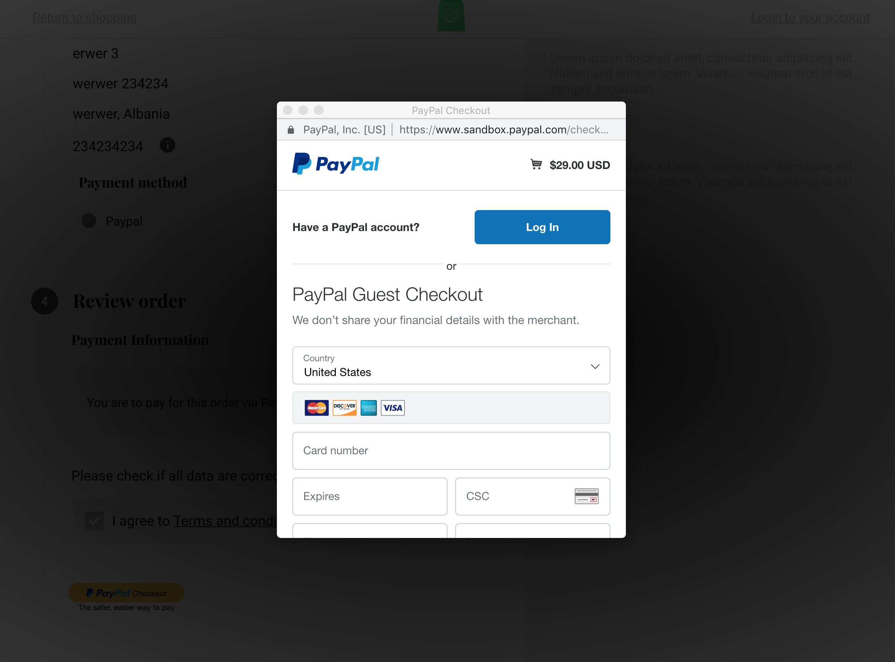

# Vue Storefront PayPal Payment Extension using Magento 2

PayPal Payment Magento 2 module for [vue-storefront](https://github.com/DivanteLtd/vue-storefront), forked from [Develo Design](https://github.com/develodesign/vsf-payment-paypal).



Tested with 1.10.x

This module is for those who want to use Magento 2's built in Paypal extension that uses the deprecated NVP/Soap api. Tested on Magento 2.2.x. This allows for backend Magento2 management of the Order lifecycle.

***Note this only tested on US and using region_code, region_id, and region modifications on the cart/order syncTotals functions and in the Checkout Addresses***

This module can also be used with the newer API calls easily, as address and cart items are set to be transferred to Paypal SmartButton.

In Button.vue change:

```js
mounted () {
  window.paypal.Buttons({
    ...
    createOrder: this.createOrderNvp,
    ...
  }).render('.paypal-button')
},
```

to

```js
mounted () {
  window.paypal.Buttons({
    ...
    createOrder: this.createOrderRest,
    ...
  }).render('.paypal-button')
},
```

## Installation

By hand (preferer):

```shell
$ git clone git@github.com:tonyisworking/vsf-payment-paypal-magento2.git ./vue-storefront/src/modules/payment-paypal-magento2
```

```json
"paymentPaypalMagento2": {
  "clientId": "",
  "endpoint": {
    "complete": "http://localhost:8080/api/ext/paypal/complete",
    "setExpressCheckout": "http://localhost:8080/api/ext/payment-paypal-magento2/setExpressCheckout"
  }
}
```

## Registration the Paypal module

Open in you editor `./src/modules/index.ts`

```js
...
import { PaymentPaypalMagento2 } from './payment-paypal-magento2';

export const registerModules: VueStorefrontModule[] = [
  ...,
  PaymentPaypalMagento2
]
```

## Paypal payment Checkout Review

Under your theme `components/core/blocks/Checkout/OrderReview.vue` add the following import to your script

```js
import PaypalButton from 'src/modules/payment-paypal-magento2/components/Button'

export default {
  components: {
    ...
    PaypalButton
  },
  ...
  computed: {
    payment () {
      return this.$store.state.checkout.paymentDetails
    }
  },
```

And to you template add the paypal button before `button-full`:

```html
<paypal-button v-if="payment.paymentMethod === 'paypal_express'"/>
<button-full
  v-else
  @click.native="placeOrder"
  data-testid="orderReviewSubmit"
  class="place-order-btn"
  :disabled="$v.orderReview.$invalid"
>
  {{ $t('Place the order') }}
</button-full>
```

## PayPal payment API extension

Setup dependency to api:
`cd ../vue-storefront-api`
`yarn add -W @paypal/checkout-server-sdk`
`npm add paypal-nvp-api`

Install extension to `vue-storefront-api`:

```shell
$ cp -fr src/modules/payment-paypal-magento2/api/payment-paypal-magento2 ../vue-storefront-api/src/api/extensions/
```

Go to api config  `./vue-storefront-api/config/local.json` and register the Paypal Api extension:

```json
"registeredExtensions": [
    ...
    "payment-paypal-magento2"
]
```

And add the `paymentPaypalMagento2` settings to `extensions` key:

Add the following also to your `config/local.json` need set `paypal.env` to `sandbox` or `live`.

```json
  "extensions": {
    "paymentPaypalMagento2": {
      "env": "sandbox",
      "clientId": "",
      "secret": "",
      "username": "",
      "password": "",
      "signature": ""
    },
    ...
  }
```

## Magento2 integration

Turn on Paypal Express and provide the API credentials using the built in Paypal module. Enable only Express Checkout.

Other Paypal methods are not supportted or tested right now.

## Customization

Also we can use `paypal.style` option for more customizable PayPal button view. For more info [PayPal](https://developer.paypal.com/demo/checkout/#/pattern/checkout).

In Button.vue, the button takes prop styling

```json
"style": {
  "size": "small",
  "color": "gold",
  "shape": "pill"
}
```
